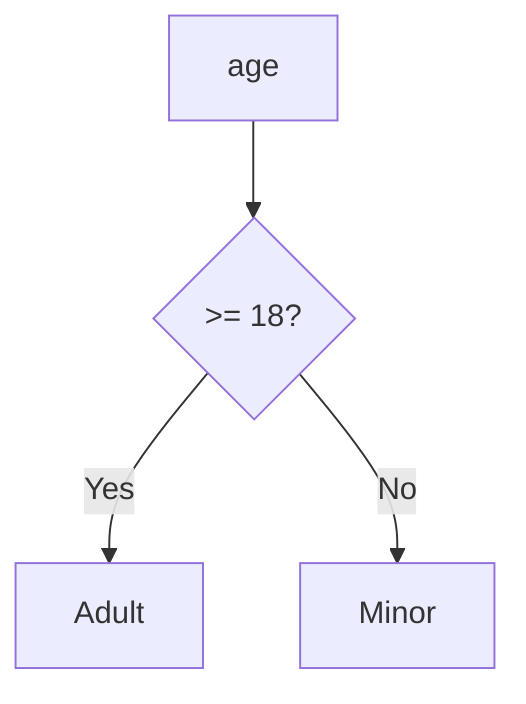

# 01. Python Foundations for Django

> Python is the base language behind Django and DRF. If this part is clear, the rest of Django becomes much easier.

## 📌 Quick Map

| Topic | Main Idea |
|---|---|
| Variables | store data |
| Data types | define shape of data |
| Operators | compare or calculate |
| Conditions | make decisions |
| Loops | repeat work |
| Data structures | organize data |

## 1) What is Python?

Python is a readable programming language. Django uses Python for models, views, serializers, tests, and utility code.

## 2) Variables and Data Types

Variables are names that hold values.

```python
name = "Awais"
age = 22
is_active = True
```

| Value | Type |
|---|---|
| `"Awais"` | `str` |
| `22` | `int` |
| `True` | `bool` |

### Small Shape

```text
name  -> "Awais"
age   -> 22
active-> True
```

## 3) Operators

Operators work on values.

| Type | Example |
|---|---|
| Arithmetic | `5 + 2` |
| Comparison | `5 > 2` |
| Logical | `True and False` |
| Membership | `'a' in 'cat'` |
| Identity | `a is b` |

## 4) Conditions

Conditions help Python choose one path.

```python
if age >= 18:
    print("Adult")
else:
    print("Minor")
```



## 5) Loops

Loops repeat a block of code.

```python
for item in [1, 2, 3]:
    print(item)
```

```text
Start -> Check -> Run -> Repeat -> End
```

## 6) Data Structures

| Structure | Best For |
|---|---|
| List | ordered collection |
| Tuple | fixed collection |
| Set | unique items |
| Dictionary | key-value data |

```python
student = {"id": 1, "name": "Ali"}
```

## Why It Matters in Django

- Request data often comes as dictionaries.
- Query results are often handled as lists.
- Validation depends on conditions.
- Django code uses these basics everywhere.
