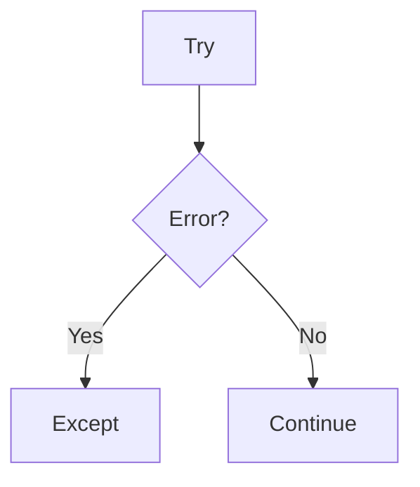

# 04. Advanced Python Concepts

> These topics help you write safer and cleaner Python. They show up in Django when handling errors, resources, and reusable logic.

## 📌 Quick Map

| Topic | Use |
|---|---|
| Exceptions | handle errors |
| Iterators | move step by step |
| Generators | produce values lazily |
| Decorators | wrap behavior |
| Context managers | manage resources |

## 1) Exception Handling

```python
try:
    value = 10 / 0
except ZeroDivisionError:
    value = 0
```



## 2) Iterators and Generators

| Term | Meaning |
|---|---|
| Iterable | can be looped over |
| Iterator | gives next item |
| Generator | iterator using `yield` |

```python
def counter():
    yield 1
    yield 2
    yield 3
```

```text
counter() -> 1 -> 2 -> 3
```

## 3) Decorators

Decorators wrap a function and add extra behavior.

```python
def my_decorator(func):
    def wrapper():
        return func()
    return wrapper
```

## 4) Context Managers

They manage things that must be opened and closed safely.

```python
with open("file.txt") as file:
    data = file.read()
```

```text
enter -> use -> exit
```

## 5) Concurrency Basics

| Type | Best For |
|---|---|
| Threading | I/O-heavy work |
| Multiprocessing | CPU-heavy work |
| Async | waiting tasks |

## Why It Matters in Django

- Decorators are common in views and permissions.
- Context managers help with files and resources.
- Generators and exceptions appear in clean backend code.
