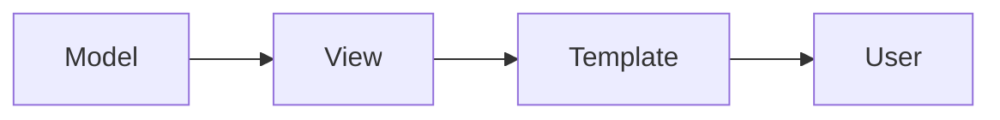

# 06. Django Fundamentals

> Django is a Python web framework that gives you built-in tools for websites and APIs.

## 📌 Quick Map

| Part | Meaning |
|---|---|
| MVT | Django architecture |
| `manage.py` | run commands |
| `settings.py` | configuration |
| `urls.py` | routing |
| `apps.py` | app setup |

## 1) What is Django?

Django helps you build apps faster with built-in auth, admin, ORM, security, and routing.



## 2) Project Structure

| File | Purpose |
|---|---|
| `manage.py` | project commands |
| `settings.py` | project settings |
| `urls.py` | URL mapping |
| `wsgi.py` | WSGI entry |
| `asgi.py` | ASGI entry |

## 3) Apps

A project can have many apps. Each app handles one feature area.

```text
Project -> users app, blog app, orders app
```

## 4) Request Flow

```text
Browser -> URL -> View -> Model/Template -> Response
```

## 5) WSGI vs ASGI

| Term | Meaning |
|---|---|
| WSGI | synchronous interface |
| ASGI | async-capable interface |

## Why It Matters in Django

- It explains how the project is organized.
- It shows how request handling works.
- It is the base for all Django and DRF work.
