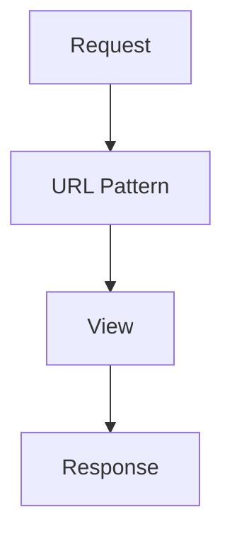

# 07. URLs, Views, and Routing

> URLs choose the code path. Views decide the response.

## 📌 Quick Map

| Part | Meaning |
|---|---|
| URL config | maps path to code |
| View | handles request |
| Response | sends output back |

## 1) URL Configuration

Common helpers:

- `path()`
- `re_path()`
- `include()`

```text
/hello/ -> hello_view
/api/users/ -> users_view
```

## 2) Views

Views are functions or classes that take a request and return a response.

| View Type | Use |
|---|---|
| Function-based view | simple logic |
| Class-based view | organized logic |
| Generic view | common patterns |

## 3) Dynamic URLs

```text
/users/5/
/products/phone-case/
```

| Pattern | Example |
|---|---|
| parameter | `id` |
| slug | `phone-case` |
| query string | `?page=2` |

## 4) Response Handling

| Response | Use |
|---|---|
| `HttpResponse` | text/HTML |
| `JsonResponse` | JSON |
| `render()` | template page |
| redirect | send elsewhere |

## 5) Routing Flow



## Why It Matters in Django

- Every request starts with a URL.
- Views contain the main logic.
- Clean routing makes the project easier to read.
