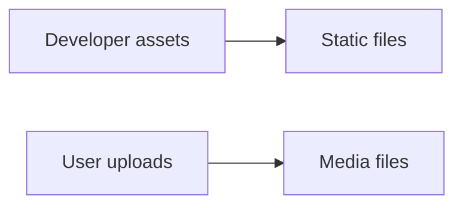

# 09. Static and Media Files

> Static files are app assets. Media files are user uploads.

## 📌 Quick Comparison

| Type | Example | Source |
|---|---|---|
| Static | CSS, JS, images | developer |
| Media | profile photos, uploads | user |

## 1) Static Files

```text
static/
  css/
  js/
  images/
```

| Setting | Meaning |
|---|---|
| `STATIC_URL` | public static prefix |
| `STATICFILES_DIRS` | extra static folders |
| `collectstatic` | collect for production |

## 2) Media Files

```text
media/
  profile.jpg
  invoice.pdf
```

| Setting | Meaning |
|---|---|
| `MEDIA_URL` | public media prefix |
| `MEDIA_ROOT` | upload folder |

## 3) Static vs Media Diagram



## Why It Matters

- Static files make the site look right.
- Media files store user content.
- Both need proper setup in deployment.
